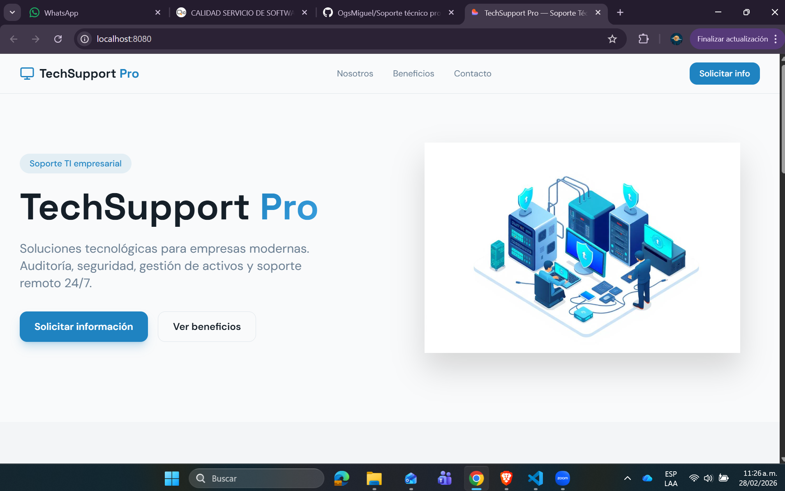
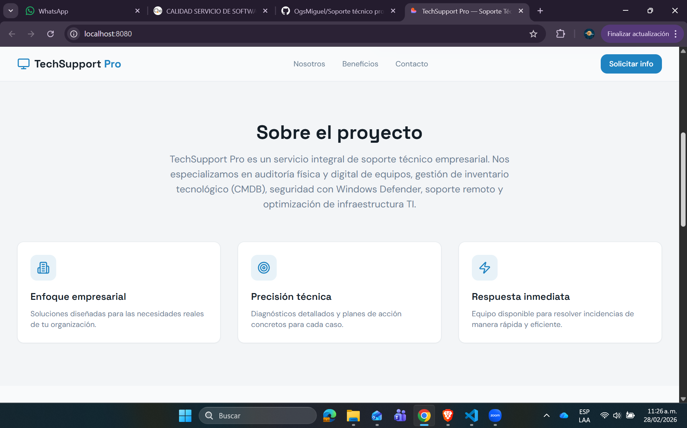
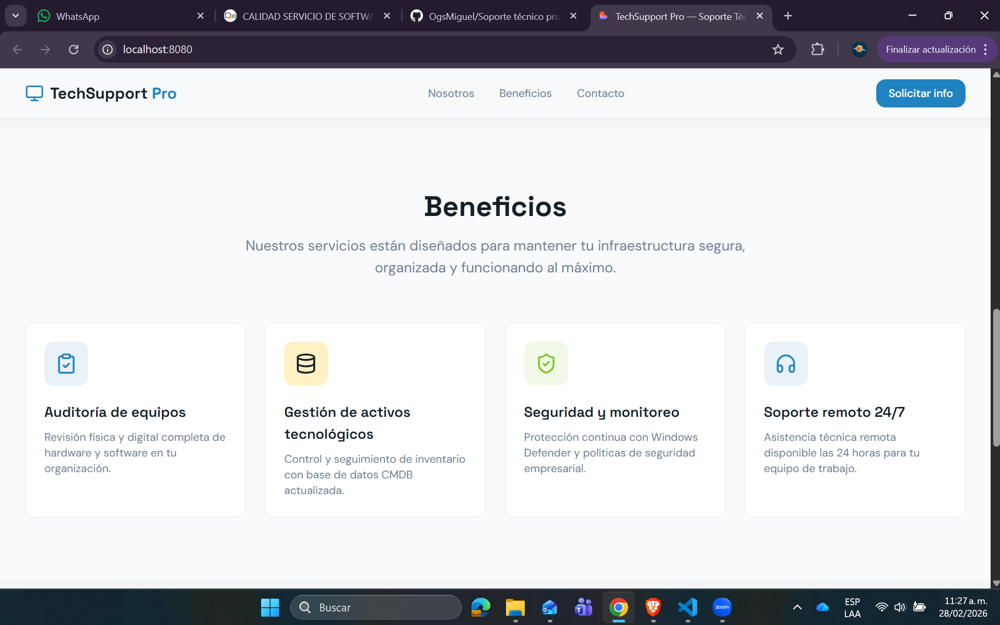

# TechSupport Pro

## Información General

Nombre del Proyecto: TechSupport Pro  
Estudiante: Miguel Nava  
Fecha: Marzo 2026  
Curso: Desarrollo Web  

---

## Descripción del Proyecto

TechSupport Pro es una aplicación web desarrollada con React que permite gestionar y visualizar activos tecnológicos como laptops, monitores y otros dispositivos asignados dentro de una organización.

La aplicación está estructurada bajo una arquitectura basada en componentes, lo que permite dividir la interfaz en partes pequeñas, reutilizables y organizadas.

---

## Problema que Soluciona

En muchas organizaciones la gestión de activos tecnológicos se realiza de forma manual o desorganizada, lo que dificulta el control y seguimiento de equipos asignados.

Este sistema permite registrar, visualizar y administrar activos tecnológicos de manera estructurada y dinámica.

---

## Tecnologías Utilizadas

- React  
- JavaScript / TypeScript  
- Vite  
- HTML5  
- CSS  
- Tailwind CSS  
- Node.js  
- Git y GitHub  

---

## Arquitectura del Proyecto

El proyecto sigue una arquitectura basada en componentes.

Flujo de ejecución:

1. index.html contiene el contenedor principal.
2. main.tsx conecta React con el DOM.
3. App.tsx organiza la aplicación.
4. Los componentes renderizan la interfaz.
5. El estado controla la información dinámica.

---

## Estructura del Proyecto

TechSupport-Pro  
│  
├── public/  
├── src/  
│   ├── components/  
│   ├── pages/  
│   ├── App.tsx  
│   └── main.tsx  
│  
└── README.md  

---

## Funcionalidades

1. Visualización de activos tecnológicos registrados.
2. Renderizado dinámico utilizando map().
3. Manejo de estado con useState.
4. Formularios controlados.
5. Comunicación entre componentes mediante props.

---

## Capturas de Pantalla

### Página principal

### Vista de activos

### Formulario

---

## Cómo Ejecutar el Proyecto

1. Clonar el repositorio  
   git clone URL_DEL_REPOSITORIO  

2. Entrar a la carpeta del proyecto  
   cd TechSupport-Pro  

3. Instalar dependencias  
   npm install  

4. Ejecutar el proyecto  
   npm run dev  

5. Abrir en el navegador  
   http://localhost:8080  

---

## Mejoras Futuras

- Implementar autenticación de usuarios.  
- Conectar con una base de datos.  
- Agregar filtros avanzados.  
- Implementar roles de usuario.  
- Mejorar el diseño responsive.  

---

## Conclusión

El proyecto fue desarrollado aplicando buenas prácticas de React y arquitectura modular. Se comprendió el uso de componentes, estado, props y renderizado dinámico dentro de una aplicación moderna.